---
typora-copy-images-to:media
---
# Opencv4 C++入门30讲笔记
**学习路线**
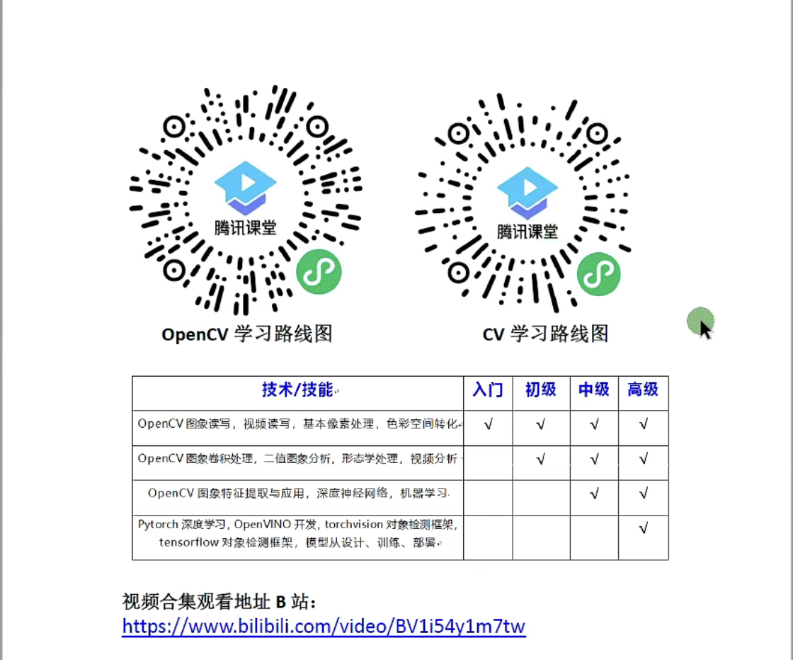
## day1:图片读取与显示
知识点：
1. ```imread()``` 图像读入
2. ```imshow()``` 图像显示
3. ```waitKey()``` 窗口显示回调函数
4. ```namedWindow()``` 创建显示窗口函数
```c++
// 加载图片时可能遇到图片大小溢出屏幕范围的情况，可以使用namedWindow()函数创建不同显示模式的窗口
Mat img = imread(path, flags); // flags控制读取模式，比如灰度、有透明通道的图片、位深度等等
namedWindow("free style", WINDOW_FREEAITO);
imshow("free style", img);
```
```c++
// 完整示例程序
#include <iostream>
#include <opencv2/opencv.hpp>

using namespace std;
using namespace cv;

int main(int argc, char** argv){
    Mat img = imread("../img/29.bmp", IMREAD_GRAYSCALE); // 加载成灰度图像
    if(img.empty()){
        cout << "could not load image" << endl;
        return -1;
    }
    namedWindow("input", WINDOW_AUTOSIZE); // 以自由比例显示一张图
    imshow("input", img);
    waitKey(0);
    destroyAllWindows();
    return 0;
}
```
## day2:图像色彩空间转换
知识点：
1. ```cvtColor()``` 色彩空间转换函数
   1. COLOR_BGR2GRAY = 6 彩色转灰度
   2. COLOR_GARY2BGR = 8 灰度转彩色
   3. COLOR_BGR2HSV = 40 彩色转HSV
   4. COLOR_HSV2BGR = 54 HSV转彩色
2. ```imwrite()``` 图像保存
   1. 第一个参数是图像保存路径
   2. 第二个参数是图像内存对象（Mat）
   
## day3:图像对象的创建与赋值
1. 怎么创建Mat对象
2. 怎么访问每一个像素
3. 怎么操作Mat
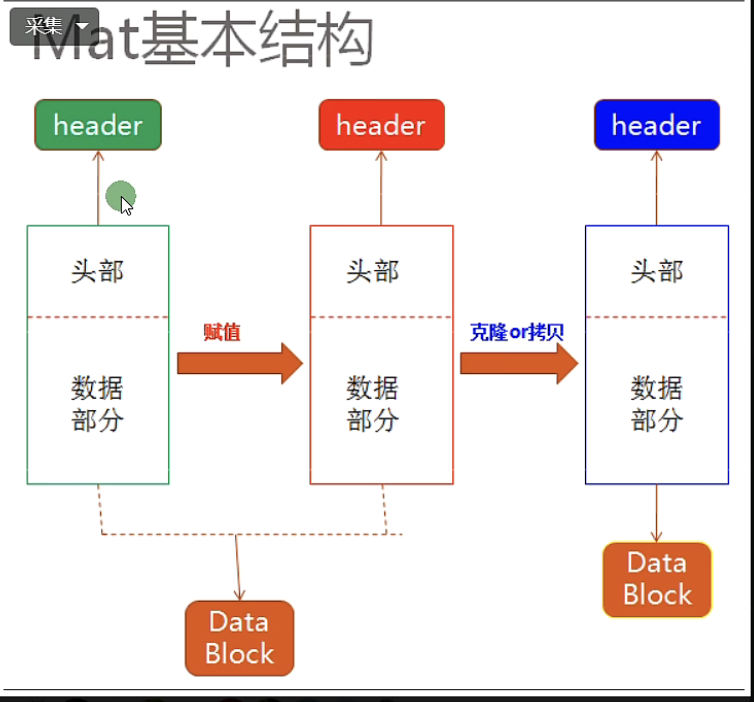
   
```c++
int main(int argc, char** argv){
    Mat img = imread("../avatar.jpeg"); // 加载成灰度图像
    if(img.empty()){
        cout << "could not load image" << endl;
        return -1;
    }
    // 创建方法1 - 克隆
    Mat m1 = img.clone();
    // 复制
    Mat m2;
    img.copyTo(m2);

    // 赋值
    Mat m3 = img; // m3和img指向同一个data block，
    // 浅拷贝，通过m3修改datablock内容则img指向的内容也同步被修改

    // 创建空白图像
    Mat m4 = Mat::zeros(img.size(), img.type());
    Mat m5 = Mat::zeros(Size(512,512),CV_8UC3);
    Mat m6 = Mat::zeros(Size(512,512),CV_8UC3);
    // C++11之后才有的创建方法
    Mat kernel = (Mat_<char>(3,3)<< 0,-1,0,-1,5,-1,0,-1,0);
    return 0;
}
```
```c++
void QuickDemo::matCreationDemo(Mat &image) {
   Mat dst_cl, dst_cp;
   dst_cl = image.clone();
   image.copyTo(dst_cp);
   // 创建空白图像，有zeros()和ones()两种创建方式，
   // 注意ones在创建单通道图的时候正确，但是在创建多通道图的时候只会给第一个通道赋值为1，其余通道赋值为0
   Mat m3 = Mat::zeros(Size(8,8), CV_8UC1);
   std::cout<< "width: " << m3.cols << ", height: " << m3.rows << ", channels: " << m3.channels() <<std::endl;
   std::cout << m3 << std::endl;
   std:: cout << "-----------" << std::endl;
   // 注意这个m4通道数是3，那么一个像素点包含3个通道的值，即一个像素点有3个值来描述
   Mat m4 = Mat::zeros(Size(8,8), CV_8UC3);
   std::cout<< "width: " << m4.cols << ", height: " << m4.rows << ", channels: " << m4.channels() << std::endl;
   std::cout << m4 << std::endl;
   // width: 8, height: 8, channels: 3
   Mat m5 = Mat::ones(Size(8,8), CV_8UC3);
   std::cout<< "width: " << m5.cols << ", height: " << m5.rows << ", channels: " << m5.channels() << std::endl;
   std::cout << m5 << std::endl;
   // width: 8, height: 8, channels: 3
   
   // 创建图像并给每个通道赋值
   Mat m6 = Mat::zeros(Size(64,64), CV_8UC3);
   m6 = Scalar(255,128,129); // 给不同通道赋值，比如3通道则分别对应B\G\R
   std::cout<< "width: " << m6.cols << ", height: " << m6.rows << ", channels: " << m6.channels() << std::endl;
   std::cout << m6 << std::endl;
   imshow("m6", m6);
   
   Mat m7 = m6;
   m7 = Scalar(0,255,255);
   imshow("m6 after change", m6);
   imshow("m7", m6);
   
   Mat m8 = m6.clone();
   m8 = Scalar(255,0,0);
   imshow("m8", m8);
   imshow("m6 after clone", m6);
}
```

## day4:图像像素的读写操作（C++）
1. 数组遍历
2. 指针方式遍历
```c++
void QuickDemo::pixelVisitDemo(Mat &image) {
    int w = image.cols;
    int h = image.rows;
    int c = image.channels();
    if(c == 1) std::cout << "灰度图" << std::endl;
    else std::cout << "彩色图,且通道数为：" << c << std::endl;
    // 在++操作的时候使用++i比i++少一次底层的拷贝
//    for(int row = 0; row < h; ++row){
//        uchar* currentRow = image.ptr<uchar>(row);
//        for(int col = 0; col < w; ++col){
//            if(c == 1){//单通道灰度图像
//                int pv = *currentRow;
//                *currentRow++ = 255-pv; // 先赋值后++
//            }else if(c == 3){//彩色图像
//                *currentRow++ = 255-*currentRow; // 先赋值后++
//                *currentRow++ = 255-*currentRow; // 先赋值后++
//                *currentRow++ = 255-*currentRow; // 先赋值后++
//            }
//        }
//    }
    for(int row = 0; row < h; ++row){
        uchar* currentRow = image.ptr<uchar>(row);
        for(int col = 0; col < w; ++col){
            if(c == 1){//单通道灰度图像
                // 原来是存的uchar类型，这里会进行隐式转换
                int pv = image.at<uchar>(row,col);
                // 黑白转换,即反相
                image.at<uchar>(row,col) = 255-pv;
                // 这里如果用1000-pv，那么得到的值会溢出，后面还会有Mat中存储类型的转换操作要学
            }else if(c == 3){//彩色图像
                // Vec3b中每一个通道都存的uchar
                Vec3b bgr = image.at<Vec3b>(row,col);
                image.at<Vec3b>(row,col)[0] = 255-bgr[0];
                image.at<Vec3b>(row,col)[1] = 255-bgr[1];
                image.at<Vec3b>(row,col)[2] = 255-bgr[2];

            }
        }
    }
    imshow("pixel read and write", image);
}
```

## day5:图像像素的算术操作（C++）
1. 加add、减subtract、乘multiply、除divide
2. saturate_cast<T>(value)
**注意点：图像的数据类型、通道数目、大小必须相同**
   
```c++
    Mat dst;
   // 使用标量 直接做简单的加减乘除
   // 加减
   dst = image - Scalar (50,50,50);
   imshow("+ or - operator", dst);
   // 乘除
   dst = image / Scalar (2,2,2);
   imshow("/ operator", dst);
   Mat m = Mat::zeros(image.size(), image.type());
   m = Scalar(50,50,50);
   multiply(m, image, dst);
   imshow("* operator", dst);
   
   dst = image * 2; // 不能Scalar(2,2,2)，会报错
   imshow("* operator 2", dst);
    // 自己实现add
    dst = Mat::zeros(image.size(), image.type());
    int w = image.cols, h = image.rows, c = image.channels();
    for(int row = 0; row < h; ++row){
        for(int col = 0; col < w; ++col){
            Vec3b p1 = image.at<Vec3b>(row,col);
            Vec3b p2 = m.at<Vec3b>(row,col);
            // saturate_cast会有溢出保护
            dst.at<Vec3b>(row,col)[0] = saturate_cast<uchar>(p1[0] + p2[0]);
            dst.at<Vec3b>(row,col)[1] = saturate_cast<uchar>(p1[1] + p2[1]);
            dst.at<Vec3b>(row,col)[2] = saturate_cast<uchar>(p1[2] + p2[2]);
        }
    }
    imshow("custom add func", dst);
    m = Scalar(5,5,5);
    // 调用opencv的库函数
    add(image,m,dst);
    imshow("official add func", dst);
    subtract(image,m,dst);
    imshow("official subtract func", dst);
    divide(image,m,dst);
    imshow("official divide func", dst);
    multiply(image,m,dst);
    imshow("official multiply func", dst);
```

## day6:TrackBar滚动条操作演示（涉及GUI）
**重点：Opencv中GUI的使用和回调函数编写与传参**

比较难的是opencv版本不同可能会有不同的错误，这里的传参形式较之视频中有一些改变，主要是传跟踪变量的引用地址会报错。
```c++
static void on_contrast(int pos, void* userdata){
    Mat image = *((Mat*)userdata);
    std::cout << "pos value: " << pos << std::endl;
    Mat m = Mat::zeros(image.size(), image.type());
    Mat dst = Mat::zeros(image.size(), image.type());
    double contrast = pos/100.0;
    // 融合两张图
    addWeighted(image, contrast, m, 0.0, 0, dst);
    //变亮
    //add(image, m, dst);
    //变暗
    //subtract(image, m, dst);
    imshow("Lightness&Contrast change", dst);
}

void QuickDemo::trackBarDemo(Mat& image){
    namedWindow("Lightness&Contrast change", WINDOW_AUTOSIZE);
    int max_value = 100;
    int lightness = 0;
    createTrackbar("Lightness Value Bar", "Lightness&Contrast change", nullptr, 100, on_lightness, &image);
    setTrackbarPos("Lightness Value Bar", "Lightness&Contrast change", lightness);
    //参数依次是 bar的名称，window名称，跟踪的值的地址（因为要随时调整），取值范围（最大值），回调函数callback, 传入的userdata（void *）
    //之前传&lightness会报错，可能是opencv版本问题，因此这里根据错误提示传入了空指针，值的跟踪通过on_track的两个传入参数来获取
    //on_track(50,&image); //本来这种写法，可能是编译器认为不安全，并且这样写的程序会报段错误，所以采用了void* userdata直接在create的时候传参（图片数据）。
    createTrackbar("Contrast Value Bar", "Lightness&Contrast change", nullptr, 200, on_contrast, &image);
    setTrackbarPos("Contrast Value Bar", "Lightness&Contrast change", 100);
    imshow("Lightness&Contrast change", image);
}
```

## day7:键盘响应操作
```c++
void QuickDemo::keyDemo(Mat &image) {
    Mat dst = Mat::zeros(image.size(), image.type());
    while(true){
        // 在循环中不断监听键盘操作
        // 每次等待100毫秒再做响应，这里是为了演示把间隔时间设置比较长，在做视频分析的时候就要注意设置一个小的值，比如waitKey(1)
        int c = waitKey(100);
        if(c == 13|| c==27){
            //13是回车，27是esc
            break;
        }
        if(c == 49 || c == 50 || c == 51){
            //Key #1
            std::cout << "you input key: " << (char)c << std::endl;
            if(c == 49){
                // 按1变灰度
                cvtColor(image, dst, COLOR_BGR2GRAY);
            }else if(c == 50){
                // 按2变hsv
                cvtColor(image, dst, COLOR_BGR2HSV);
            }else{
                // 按3提高亮度
                // 注意这一步在add的时候没有写成add(image,dst,dst)，避免在切换过程中dst的变化导致计算出错。
                add(image, Scalar(50,50,50), dst);
            }
            imshow("Key Demo", dst);
        }
    }
}
```

## day8:Opencv自带颜色表操作
知识点：Look Up Table(LUT)查找表，解释了LUT查找表的作用与用法，代码实现与API介绍
1. applyColorMap(src, dst, COLORMAP)
   1. src表示输入图像
   2. dst表示输入图像
   3. 匹配到的颜色LUT，OpenCV支持21种颜色风格的查找表映射(学习时所用的版本是OpenCV4.5.2，MacOS)
   
```c++
void QuickDemo::colorStyleDemo(Mat &image) {
    Mat dst = Mat::zeros(image.size(), image.type());
    int colorMap[]={
        COLORMAP_AUTUMN,
        COLORMAP_BONE,
        COLORMAP_JET,
        COLORMAP_WINTER,
        COLORMAP_RAINBOW,
        COLORMAP_OCEAN,
        COLORMAP_SUMMER,
        COLORMAP_SPRING,
        COLORMAP_COOL,
        COLORMAP_HSV,
        COLORMAP_PINK,
        COLORMAP_HOT,
        COLORMAP_PARULA,
        COLORMAP_MAGMA,
        COLORMAP_INFERNO,
        COLORMAP_PLASMA,
        COLORMAP_VIRIDIS,
        COLORMAP_CIVIDIS,
        COLORMAP_TWILIGHT,
        COLORMAP_TWILIGHT_SHIFTED,
        COLORMAP_TURBO,
        COLORMAP_DEEPGREEN
    };
    int index = 0;
    while(true){
        int c = waitKey(1000);
        if(c==27 || c==13) break;
        // 可以给灰度图像填伪彩色
        applyColorMap(image, dst, colorMap[index]);
        index = (index+1)%21;
        imshow("颜色风格", dst);
    }
}
```

## day9:图像像素的逻辑操作
知识点：像素操作之逻辑操作
1. bitwise_and
2. bitwise_xor
3. bitwise_or
4. bitwise_not

前面三个类似，都是针对两张图像的位操作，最后一个是针对输入图像的取反操作，二值图像分析中经常使用

| 图像1 | 图像2 | 与 | 或 | 异或 |
| --- |--- | --- | --- | --- |
| 0 | 0 | 0 | 0 | 0 |
| 0 | 1 | 0 | 1 | 1 |
| 1 | 0 | 0 | 1 | 1 |
| 1 | 1 | 1 | 1 | 0 |

```c++
void QuickDemo::bitwiseDemo(Mat &image) {
    Mat m1 = Mat::zeros(Size(256,256), CV_8UC3);
    Mat m2 = Mat::zeros(Size(256,256), CV_8UC3);
    // rect(画矩形的背景图，Rect(左上角的坐标，宽度，高度），矩形颜色，
    // 线宽（小于0表示填充，大于0表示边框线宽绘制）,线绘制方式(因为直线所经过的点坐标有时候并不是整数，绘制的时候会产生锯齿
    // 因此有不同的绘制方式，比如说不管锯齿的话，有400和800的两种绘制方式，常用的有LINE_8，而如果管锯齿的影响的话，希望这个锯齿和周围的颜色有点交融，就是LINE_AA，即反锯齿的绘制模式),
    rectangle(m1, Rect(100,100,80,80), Scalar(255,255,0), -1, LINE_8,0);
    rectangle(m2, Rect(150,150,80,80), Scalar(0,255,255), -1, LINE_8,0);
    imshow("m1",m1);
    imshow("m2",m2);

    Mat dst;
    bitwise_and(m1,m2,dst);
    imshow("bitwise_and", dst);
    bitwise_or(m1,m2,dst);
    imshow("bitwise_or", dst);
    bitwise_xor(m1,m2,dst);
    imshow("bitwise_xor", dst);
    bitwise_not(m1,dst);
    imshow("bitwise_not", dst);
    Mat m3 = ~m1;
    imshow("~m1", m3);
}
```


## day10:图像通道的分离与合并
知识点：通道分离与合并

OpenCV中默认imread函数加载图像文件，加载进来的是三通道彩色图像，色彩空间是RGB色彩空间，通道顺序是BGR（蓝色、绿色、红色），对于三通道的图像OpenCV中提供了两个API函数用以实现通道分离与合并
1. ```split //通道分离```
2. ```merge //通道合并```

扩展一下：

在很多的CNN的卷积神经网络中输入的图像一般会要求```[h,w,ch]```，其中h是高度，w是宽度，ch是指通道数目，OpenCV DNN模块中关于图像分类的googleNet模型输入```[224,224,3]```，表示的就是224x224大小的三通道的彩色图像输入

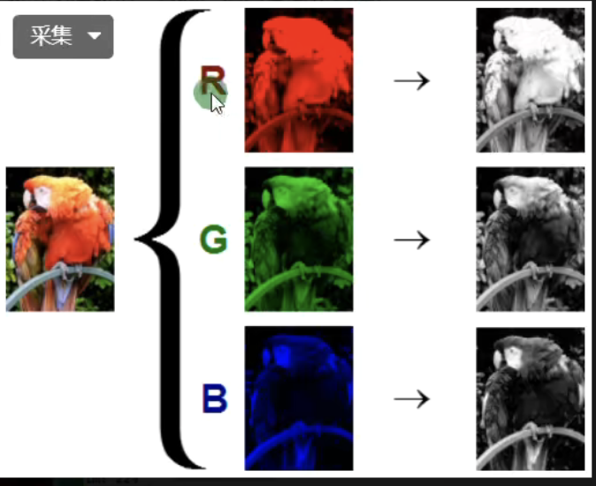

```c++
void mixChannels(
   const Mat* src, //输入数组或向量矩阵,所有矩阵的大小和深度必须相同。
   size_t nsrcs, //矩阵的数量
   Mat* dst, //输出数组或矩阵向量,大小和
   深度必须与src[0]相同
   size_t ndsts,//矩阵的数量
   const int* fromTo,//指定被复制通道与要复制到的位置组成的索引对
   size_t npairs //fromTo中索引对的数目
);
```
```C++
/*
 * 例子
将一个4通道BGRA图像分割成一个3通道BGR和一个单独的alpha通道图像：
其中，索引对from_to[] = { 0, 2, 1, 1, 2, 0, 3, 3 }的含义为：
bgra的0通道复制到out[]的2通道，即bgr的0通道；
bgra的1通道复制到out[]的1通道，即bgr的1通道；
bgra的2通道复制到out[]的0通道，即bgr的2通道；
bgra的3通道复制到out[]的3通道，即alpha通道；
 * 
 */
#include<opencv2/opencv.hpp>
using namespace cv;
int main()
{
    Mat bgra( 500, 500, CV_8UC4, Scalar(255,255,0,255) );
    Mat bgr( bgra.rows, bgra.cols, CV_8UC3 );
    Mat alpha( bgra.rows, bgra.cols, CV_8UC1 );
    Mat out[] = { bgr, alpha };
    int from_to[] = { 0, 2, 1, 1, 2, 0, 3, 3 };
    mixChannels( &bgra, 1, out, 2, from_to, 4 );
    imshow("bgra", bgra);
    imshow("bgr", bgr);
    waitKey(0);
    return 0;
}
```
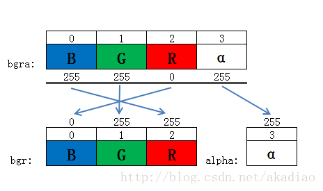


## day11:图像色彩空间与色彩空间转换
1. RGB色彩空间
2. HSV色彩空间：[HSV色彩空间介绍](https://mp.weixin.qq.com/s?__biz=MzA4Nzk0NTU0Nw==&mid=2247486089&idx=1&sn=be8cc64b936e5a44f043b84d5b575efe&chksm=9030f2ada7477bbbb2e20f1b287c9ce299336a38cddd47c89eb935ee394f96922e4092568337&scene=21#wechat_redirect)
   1. H: Hue，色相，用度数来描述，如12色相环
   2. S: Saturation，饱和度，色彩的深浅度（0-100%）
   3. V: Value，色调，纯度，色彩的亮度
   
3. YUV色彩空间
4. YCrCb色彩空间

API知识点
1. 色彩空间转换cvtColor
2. 提取指定色彩范围区域inRange

HSV与RGB颜色空间转换表(H：0-180，S：0-255，V：0-255)

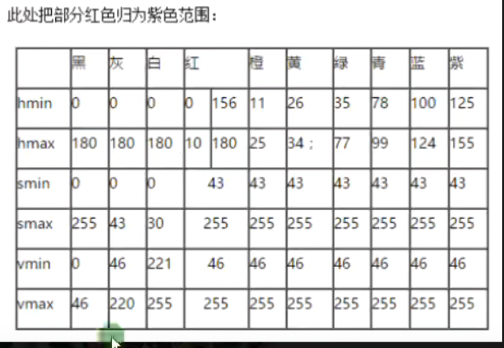

```void inRange(InputArray src, InputArray lowerb, InputArray upperb, OutputArray dst)```

官方文档中的解释：检查数组元素是否在另外两个数组元素值之间。这里的数组通常也就是矩阵Mat或向量。请注意：该函数输出的dst是一幅二值化之后的图像。

使用示例1：针对单通道图像
```dst(I) = lowerb(I)0 ≤ src(I)0 < upperb(I)0```

即，如果一幅灰度图像的某个像素的灰度值在指定的高、低阈值范围之内，则在dst图像中令该像素值为255，否则令其为0，这样就生成了一幅二值化的输出图像。

使用示例2：针对三通道图像
```dst(I) = lowerb(I)0 ≤ src(I)0 < upperb(I)0 ∧ lowerb(I)1 ≤ src(I)1 < upperb(I)1 ∧lowerb(I)2 ≤ src(I)2 < upperb(I)2```

即，每个通道的像素值都必须在规定的阈值范围内！

```c++
void QuickDemo::inRangeDemo(Mat &image) {
    Mat hsv;
    cvtColor(image, hsv, COLOR_BGR2HSV);
    Mat mask;
    // 中间两个颜色控制的是颜色转换范围，在HSV色彩空间中颜色是由H和S来控制的，更容易提取一些
    inRange(hsv, Scalar(35,43,46), Scalar(77,255,255), mask);
    imshow("Mask", mask);
    Mat redBack = Mat::zeros(image.size(), image.type());
    redBack = Scalar(40,40,200);
    bitwise_not(mask, mask); // 让人所在的像素不为0
    // 利用掩码图做不规则形状的提取
    image.copyTo(redBack, mask); // 如果设置了mask，那么在copyTo的时候只有在mask中不为0的像素点对应的位置会被copy到图像m上。
    imshow("after copy according to mask", redBack);
}
```


## day12:图像像素统计
知识点：像素值统计
1. 最小（min）
2. 最大（max）
3. 均值（mean）
4. 标准方差（standard deviation)

API知识点
1. 最大最小值minMaxLoc
   ```c++
   // 两种调用形式
   void minMaxLoc(InputArray src, double* minVal, double* maxVal=0, Point* minLoc=0, Point* maxLoc=0, InputArray mask=noArray() )
   void minMaxLoc(const SparseMat& a, double* minVal, double* maxVal, int* minIdx=0, int*maxIdx=0 )
   /*
    * Opencv中的minMaxLoc（）函数可以在一幅单通道图像上查找最大最小值及其位置坐标。
    * 里面参数很多，比如最大值maxVlaue、最小值minValue、最大值位置maxLoc、最小值位置minLoc等。
    * 看起来很繁琐但是用起来却很方便，一些不需要的参数，在调用时直接设置为0即可。
    * 函数中，最后一个参数是mask，默认为noArray()。这是一个很有用的参数。
    * 用法也很简单，先预设一个矩阵mask，其大小、数据类型与src一致，每个像素值为0。如果像搜索src某个局部区域的最大最小值，
    * 只需要把mask对应区域设置为大于0的数值即可。
    */
   ```
   ```C++
   int main()
   {
   Mat img=imread("D:/Qt/MyImage/building.jpg",);
       Mat mask(img.rows,img.cols,img.type(),Scalar::all());
       mask(Rect(,,,))= ;//设定搜索区域
       imshow("mask",mask);
       imshow("img",img);
       double maxv;
       minMaxLoc(img,,&maxv,,,mask);
       cout<<"maxvalue="<<maxv<<endl;
       waitKey();
       return ;
   }
   ```
2. 计算均值与标准方差meanStdDev

通过方差大小可以看出来图像局部像素的变化程度
```c++
void QuickDemo::pixelStatisticDemo(Mat &image) {
    std::vector<Mat> mv;
    split(image, mv);
    double minv, maxv;
    Point minLoc, maxLoc;
    int cnt = 0;
    for(auto& m:mv){
        // 要求是单通道图的统计
        minMaxLoc(m, &minv, &maxv, &minLoc, &maxLoc, Mat());
        std::cout << "min value: " << minv << ", max value: " << maxv << std::endl;
        std::cout << "min point: " << minLoc << "and min point pixel: " << static_cast<int>(m.at<uchar>(minLoc.x, minLoc.y)) << ", max point: " << maxLoc << "and max point pixel: " << static_cast<int>(m.at<uchar>(maxLoc.x,maxLoc.y)) << std::endl;
        imshow(std::to_string(cnt+1), m);
        cnt++;
    }

    Mat mean, stddev;
    meanStdDev(image, mean, stddev, Mat());
    for(int i = 0; i < mean.rows; i++){
        std::cout << "mean[" << i << "]: " << mean.at<double>(i,0) << ", stddev[" << i << "]: " << stddev.at<double>(i,0) << std::endl;
    }
}
```


## day13:图像几何形状绘制
[有关于Rectangle绘制各参数的意思详解](https://blog.csdn.net/sinat_41104353/article/details/85171185)
```c++
// 有矩形、圆、椭圆、线段4种图形的绘制
void QuickDemo::drawingDemo(Mat &image) {
    Rect rect;
    rect.x = 100;
    rect.y = 100;
    rect.width = 250;
    rect.height = 300;
    Mat bg = Mat::zeros(image.size(), image.type());
    rectangle(bg, rect, Scalar(0,0,255), -1, LINE_8, 0);
    circle(bg, Point(350,400), 50, Scalar(255,0,0), -1, LINE_8, 0);
    line(bg, Point(100,100), Point(350,400), Scalar(0,255,0), 2, LINE_AA,0);
    RotatedRect rrt;
    rrt.center = Point(200,200);
    // 通过Size规定椭圆的长短轴长度
    rrt.size = Size(200,300);
    rrt.angle = 30; // height顺时针转
    ellipse(bg, rrt, Scalar(0,255,255), 2, LINE_AA);
    Mat dst;
    // 图片叠加，通过设置不同的权重可以创建类似半透明的效果
    addWeighted(image,0.7,bg,0.3, 0, dst);
    imshow("drawing addWeighted", dst);
}
```


## day14:随机数和随机颜色
知识点： opencv提供了RNG类，能够非常方便的处理随机数
假设有如下任务：

1. 生成3个float类型的随机数，且服从均匀分布，每个随机数的范围是0.0-1.0
2. 生成3个double类型的随机数，且服从均值为0，方差为1的高斯分布
3. 生成3个unsigned byte类型的随机数，服从均匀分布，每个数的取值范围是0-255

针对以上问题的实现代码如下：
```c++
#include<iostream>
#include<opencv2/opencv.hpp>
using namespace std;
using uint = unsigned;
/*
1. Generate and print three floating-point numbers,each drawn from a distribution from 0.0 to 1.0
2. Generate and print three double-preision numbers,each drown from a Guassian distribution centered at
    0.0 and with standard deviation of 1.0
3. Generate and print three unsigned bytes,each drawn from a uniform distibution from 0 to 255
*/

void generate_random_numbers()
{
    cv::RNG rng = cv::theRNG();
    float f_1 = rng.uniform(0.f, 1.f);
    float f_2 = rng.uniform(0.f, 1.f);
    float f_3 = rng.uniform(0.f, 1.f);


    double d_1 = rng.gaussian(1.0);
    double d_2 = rng.gaussian(1.0);
    double d_3 = rng.gaussian(1.0);

    uint u_1 = (uint)rng.uniform(0, 255);
    uint u_2 = (uint)rng.uniform(0, 255);
    uint u_3 = (uint)rng.uniform(0, 255);

    cout << "f_1: " << f_1 << " f_2: " << f_2 << " f_3: " << f_3 << endl;
    cout << "d_1: " << d_1 << " d_2: " << d_2 << " d_3: " << d_3 << endl;
    cout << "u_1: " << u_1 << " u_2: " << u_2 << " u_3: " << u_3 << endl;
    
}
```

RNG类，不仅可以方便快捷的生成随机数，而且也支持生成随机数矩阵，针对随机数填充的矩阵，有一下任务：

1. 生成一个包含20个随机数的矩阵，每个随机数类型为float，且服从0.0-1.0的均匀分布；
2. 生成一个包含20个随机数的矩阵，每个随机数类型为float，且服从均值为0，方差为1的高斯分布
3. 生成一个包含20个随机数的矩阵，每个随机数类型为unsigned byte，且服从0-255的均匀分布；
4. 生成20个三元组构成的随机数矩阵，每个随机数类型为unsigned byte,且服从0-255的均匀分布。

其代码如下所示：

```c++
#include<iostream>
#include<opencv2/opencv.hpp>


/*
1. Using the fill method of the cv::RNG random number generator,create an array of:
    a. 20 floating-point numbers with uniform distribution from 0.0 to 1.0
    b. 20 floating-point numbers with guassian distribution centered at 0.0 and with a standard deviation of 1.0
    c. 20 unsigned bytes with a uniform distribution from 0 to 255
    d. 20 color triples,each of three bytes with a uniform distribution from 0 to 255 
*/
using namespace std;

void generate_random_matrix()
{
    cv::RNG rng = cv::theRNG();
    cv::Mat m_uniform = cv::Mat(20, 1, CV_32F, cv::Scalar(0));
    rng.fill(m_uniform, cv::RNG::UNIFORM,0.f,1.f);

    cv::Mat m_guassian = cv::Mat(20, 1, CV_32F, cv::Scalar(0));
    rng.fill(m_guassian, cv::RNG::NORMAL, 0.0, 1.0);
    //cout << m_guassian << endl;

    cv::Mat mu_uniform = cv::Mat(20, 1, CV_8UC1, cv::Scalar(0));
    rng.fill(mu_uniform, cv::RNG::UNIFORM, 0, 255);
    //cout << mu_uniform << endl;

    cv::Mat mt_uniform = cv::Mat(20, 1, CV_8UC3, cv::Scalar(0, 0, 0));
    rng.fill(mt_uniform, cv::RNG::UNIFORM, 0, 255);
    cout << mt_uniform << endl;
}
```


## day15:多边形填充与绘制
知识点：涉及到3个与多边形形状绘制、填充有关的函数
1. fillPoly
   1. 函数原型
   ```c++
   // 原型一
   void fillPoly(InputOutputArray img, const Point** pts, const int* npts, int ncontours, const Scalar& color, int lineType = LINE_8, int shift = 0, Point offset = Point());
   // 原型二
   void fillPoly(InputOutputArray img, InputArrayOfArrays pts, const Scalar& color, int lineType = LINE_8, int shift = 0, Point offset = Point());
   ```
   2. 函数功能：填充一个或多个多边形所包围的区域
      1. 第一个参数，InputOutputArray img，待填充多边形包围区域的图像；
      2. 第二个参数，InputArrayOfArrays pts，每个多边形都表示为点数组的多边形数组；
      3. 第三个参数，const Scalar& color，绘制多边形使用的颜色；
      4. 第四个参数，int lineType = LINE_8，线段的类型；
      5. 第五个参数，int shift = 0，点坐标中的小数位数；
      6. 第六个参数，Point offset = Point()，轮廓所有点的偏移；
   
2. polylines
   1. 函数原型
   ```c++
   // 原型一
   void polylines(InputOutputArray img, const Point* const* pts, const int* npts, int ncontours, bool isClosed, const Scalar& color, int thickness = 1, int lineType = LINE_8, int shift = 0);
   // 原型二
   void polylines(InputOutputArray img, InputArrayOfArrays pts, bool isClosed, const Scalar& color, int thickness = 1,int lineType = LINE_8, int shift = 0);
   ```
   2. 函数功能: 绘制几条多边形曲线； 
   3. 参数详解 
      1. 第一个参数，InputOutputArray img，待绘制多边形的图像； 
      2. 第二个参数，InputArrayOfArrays pts，多边形曲线点集； 
      3.第三个参数，bool isClosed，指示绘制的多条线是否封闭的标志；如果它们是封闭的，则函数从每条曲线的最后一个顶点画一条直线到它的第一个顶点；
      4. 第四个参数，const Scalar& color，绘制曲线所用的颜色；
      5. 第五个参数，int thickness = 1，绘制曲线的粗细；
      6. 第六个参数，int lineType = LINE_8，线段的类型；
      7. 第七个参数，int shift = 0，点坐标中的小数位数；
3. findContours & drawContours

[查找轮廓线与轮廓填充函数用法](https://www.cnblogs.com/skyfsm/p/6890863.html)

```c++
void QuickDemo::polylineDrawingDemo() {
    Mat canvas = Mat::zeros(Size(512,512), CV_8UC3);
    std::vector<Point> pts;
    Point p1(100,100);
    Point p2(350,100);
    Point p3(450,280);
    Point p4(320,450);
    Point p5(80,400);
    pts.emplace_back(p1);
    pts.emplace_back(p2);
    pts.emplace_back(p3);
    pts.emplace_back(p4);
    pts.emplace_back(p5);

    // 填充多边形
    //fillPoly(canvas, pts, Scalar(255,0,0),LINE_8,0);
    // 这个函数不能进行填充，只能根据vector点集进行多边形绘制，thickness必须大于0
    //polylines(canvas, pts, true, Scalar(0,0,255),2, LINE_AA,0);

    // drawContours()绘制或者填充轮廓，可以绘制或填充多个轮廓
    std::vector<std::vector<Point>> contours;
    contours.emplace_back(pts);
    // contourIndex指定填充哪一个轮廓，若为-1则一次性填充所有的轮廓
    // thickness同样是大于0为线宽，小于0为填充
    drawContours(canvas, contours, 0, Scalar(255,0,0), -1);
    imshow("polyline drawing", canvas);
}
```


## day16:鼠标操作与响应
鼠标操作的回调函数形式如下：

```c++
void cv::setMouseCallback(
        const String& winname,
        MouseCallback onMouse,
        void* userdata = 0
        )
// 定义函数指针
typedef void(* cv::MouseCallback)(int event, int x, int y, int flags, void* userdata);
```

一个鼠标点击并拖拽选择矩形ROI区域的例子

```c++
Point sp(-1,-1), ep(-1,-1);
Mat temp;
static void on_mouse_draw(int event, int x, int y, int flags, void* userdata){
    Mat image = *(Mat*)userdata;
    if(event == EVENT_LBUTTONDOWN) {
        // 左键按下
        sp.x = x;
        sp.y = y;
        temp.copyTo(image);
        std::cout << "start point: " << sp << std::endl;
    }
    else if(event == EVENT_LBUTTONUP){
        ep.x = min(x, image.cols);
        ep.y = min(y, image.rows);
        int dx = std::abs(ep.x-sp.x), dy = std::abs(ep.y-sp.y);
        Rect box(std::min(sp.x, std::min(image.rows, ep.x)), std::min(sp.y,std::min(image.cols, ep.y)), dx, dy);
        rectangle(image, box, Scalar(0,0,255), 2, 8, 0);
        // 绘制圆
//        int cx = (sp.x+ep.x)>>1, cy = (sp.y+ep.y)>>1;
//        double radius = std::sqrt(dx*dx+dy*dy)/2;
        temp.copyTo(image);
        rectangle(image, box, Scalar(0,0,255), 2, 8, 0);
//        circle(image, Point(cx,cy), (int)radius, Scalar(255,0,0), 2, LINE_8,0);
        imshow("mouse drawing", image);
        imshow("RoI Area", temp(box));
        // reset为下一次绘制做好准备
        sp.x = -1;
        sp.y = -1;
    }
    else if(event == EVENT_MOUSEMOVE){
        if(sp.x > 0 && sp.y > 0){
            ep.x = min(x, image.cols);
            ep.y = min(y, image.rows);
            int dx = std::abs(ep.x-sp.x), dy = std::abs(ep.y-sp.y);
            Rect box(std::min(sp.x, ep.x), std::min(sp.y, ep.y), dx, dy);
//            int cx = (sp.x+ep.x)>>1, cy = (sp.y+ep.y)>>1;
//            double radius = std::sqrt(dx*dx+dy*dy)/2;
//            imshow("mouse drawing", image);
            temp.copyTo(image);
//            circle(image, Point(cx,cy), (int)radius, Scalar(255,0,0), 2, LINE_8,0);
            rectangle(image, box, Scalar(0,0,255), 2, 8, 0);
            imshow("mouse drawing", image);
        }
    }
}

void QuickDemo::mouseDrawingDemo(Mat &image) {
    namedWindow("mouse drawing", WINDOW_AUTOSIZE);
    setMouseCallback("mouse drawing", on_mouse_draw, &image);
    imshow("mouse drawing", image);
    temp = image.clone();
}
```


## day17:图像像素类型转换与归一化
知识点：像素归一化（将矩阵中的像素值控制在同一个范围内以提高计算精度）

OpenCV中提供了四种归一化的方法
1. NORM_MINMAX
2. NORM_INF
3. NORM_L1
4. NORM_L2

最常用的就是NORM_MINMAX归一化方法，不同的norm计算公式如下：
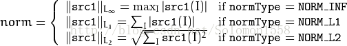

相关API函数：
```c++
//该函数归一化输入数组使它的范数或者数值范围在一定的范围内。该函数分为范围归一化与数据值归一化。
// （Normalizes the norm or value range of an array.）
normalize{
    InputArray src, // 输入数组
    InputOutputArray dst, // 输出数组，数组的大小和原数组保持一致，支持原地运算
    double alpha = 1, // range normalization模式的最小值。1.用来规范值，2.规范范围，并且是下限
    double beta = 0, // 只用来规范range normalization模式的最大值，不用于Norm normalization（范数归一化）模式
    int norm_type = NORM_L2, // 归一化的类型，可以有4种取值：NORM_MINMAX,NORM_INF,NORM_L1,NORM_L2
    int dtype = -1, // dtype为负数时，输出数组的type与输入数组的type即大小、深度、通道数都相同；
    InputArray mask = noArray() //mask默认值为空，操作掩膜，选择感兴趣区域，选定后只能对该区域进行操作。
};

// OpenCV官方文档给的例子（值归一化）
vector<double> positiveData = { 2.0, 8.0, 10.0 };
vector<double> normalizedData_l1, normalizedData_l2, normalizedData_inf, normalizedData_minmax;
// Norm to probability (total count)
// sum(numbers) = 20.0
// 2.0      0.1     (2.0/20.0)
// 8.0      0.4     (8.0/20.0)
// 10.0     0.5     (10.0/20.0)
normalize(positiveData, normalizedData_l1, 1.0, 0.0, NORM_L1);
// Norm to unit vector: ||positiveData|| = 1.0
// 2.0      0.15=2.0/sqrt(10^2+8^2+2^2)
// 8.0      0.62=8.0/sqrt(10^2+8^2+2^2)
// 10.0     0.77=10.0/sqrt(10^2+8^2+2^2)
normalize(positiveData, normalizedData_l2, 1.0, 0.0, NORM_L2);
// Norm to max element
// 2.0      0.2     (2.0/10.0)
// 8.0      0.8     (8.0/10.0)
// 10.0     1.0     (10.0/10.0)
normalize(positiveData, normalizedData_inf, 1.0, 0.0, NORM_INF);
// Norm to range [0.0;1.0]
// 2.0      0.0     (shift to left border)
// 8.0      0.75    (6.0/8.0)
// 10.0     1.0     (shift to right border)
normalize(positiveData, normalizedData_minmax, 1.0, 0.0, NORM_MINMAX);

//范围归一化
#include<opencv2/opencv.hpp>
#include<iostream>

using namespace std;

int main()
{
vector<double>a={ 10,11,234,45,65,456,0 };
cv::normalize(a, a, 0,255, cv::NORM_MINMAX);
// 结果:{5.59211,6.15132,130.855,25.1645,36.3487,255,0}
for (int i=0;i < a.size();i++)
{
cout << a[i] << endl;
}
return 0;
}
```

此外还有要注意的就是convertTo进行图像数据类型的转换，在normDemo()函数中有几种不同数据类型的图像的显示，要注意的是浮点数类型的图像数据需要归一化到0~1范围内才可以正常使用imshow()显示，但是imwrite不支持浮点类型数据的写，如果是整数类型则值在需要转换到0~255之内才可以正常显示


## day18:图像放缩与插值
最常见的四种插值算法
1. INTER_NEAREST = 0，最近邻插值
2. INTER_LINEAR = 1，双线性插值
3. INTER_CUBIC = 2，三次样条插值
4. INTER_LANCZOS4 = 4

前两种计算量较小比较快，后面两种计算量较大比较慢
相关的应用场景：resize、几何变换、透视变换、插值计算新像素

```c++
// opencv中的resize()函数
void resize(InputArray src, OutputArray dst, Size dsize, double fx=0, double fy=0, int interpolation=INTER_LINEAR)
/*
 * @param src: 原图像
 * @param dst: 输出图像
 * @param dsize: 输出图像所需大小
 * @param fx: [可选]沿水平轴的比例因子
 * @param fy: [可选]沿垂直轴的比例因子
 * @param interpolation: [可选]插值方式
 */
```

## day19:图像翻转+图像旋转
知识点：相关的API
1. 翻转：```filp(InputArray src, OutputArray dst, int filpCode); //filpCode有3种取值，1，0，-1分别对应以x轴为基准上下翻转，以y轴为基准左右翻转，以原点为基准中心对称翻转```
2. 仿射变换：```warpAffine(InputArray src, OutputArray dst, InputArray M, Size dsize, int flags, int borderMode, const Scalar& borderValue)```

可通过下图得知旋转后的图片宽高如何计算：
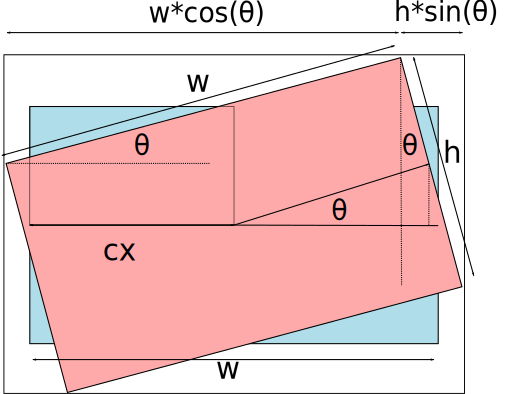

## day20:视频文件摄像头使用+视频保存与处理
知识点：主要是使用VideoCapture的实例进行视频的读入或者是调用摄像头进行实时拍摄，可以和前面编写的例子进行一些联动。
```c++
void QuickDemo::videoDemo() {
   //    VideoCapture capture(0);
   VideoCapture capture("/Users/pengguanyan/Desktop/myown/练习曲/彩虹练习3.mp4");
   // 使用capture.get()，获取视频的信息并输出
   int frameWidth = capture.get(CAP_PROP_FRAME_WIDTH);
   int frameHeight = capture.get(CAP_PROP_FRAME_HEIGHT);
   int count = capture.get(CAP_PROP_FRAME_COUNT);
   double fps = capture.get(CAP_PROP_FPS);
   std::cout << "frame width: " << frameWidth << ", frameHeight: " << frameHeight << ", count: " << count << ", fps: " << fps << std::endl;
   //使用VideoWriter保存视频
   VideoWriter writer("../test/test.mp4",capture.get(CAP_PROP_FOURCC), fps, Size(frameWidth, frameHeight), true);
   
   Mat frame;
   while(true){
   capture.read(frame);
   if(frame.empty()){
   break;
   }
   // TODO: do sth.
   flip(frame, frame, 1);
   colorSpaceDemo(frame);
   // 保存视频（没有音频），实测保存下来的视频帧率正常，并不是卡顿的
   writer.write(frame);
   imshow("frame", frame);
   int c = waitKey(10);
   if(c == 13 || c == 27) break;
   }
   // release资源
   capture.release();
}

```


## day21:图像的直方图+2D直方图绘制
图像直方图的解释：图像直方图是图像像素值的统计学特征，计算代价较小，具有图像平移、旋转、缩放不变性等众多优点，广泛地应用于图像处理的各个领域，特别是灰度图像的阈值分割、基于颜色的图像检索以及图像分类、反向投影跟踪。常见的分为：
1. 灰度直方图
2. 颜色直方图

Bins是指直方图的大小范围(灰度级别），对于像素值取值在0~255之间的，最少有256个bin，此外还可以有16、32、48、128等，256除以bin的大小应该是整数倍。

OpenCV中相关的API有：
1. ```calcHist(&bgr_plane[0], 1, 0, Mat(), b_hist, 1, bins, ranges);```
   ```c++
   void cv::calcHist(const Mat * images,
                     int  nimages,
                     const int * channels,
                     InputArray mask,
                     OutputArray hist,
                     int  dims,
                     const int * histSize,
                     const float ** ranges,
                     bool  uniform = true,
                     bool  accumulate = false 
                     )
    /* 
     * 参数说明：
     * 1. images：待统计直方图的图像数组，数组中所有的图像应具有相同的尺寸和数据类型，并且数据类型只能是CV_8U、CV_16U和CV_32F三种中的一种，但是不同图像的通道数可以不同。
     * 2. nimages：输入的图像数量
     * 3. channels：需要统计的通道索引数组，第一个图像的通道索引从0到images[0].channels()-1，第二个图像通道索引从images[0].channels()到images[0].channels()+images[1].channels()-1，以此类推。
     * 4. mask：可选的操作掩码，如果是空矩阵则表示图像中所有位置的像素都计入直方图中，如果矩阵不为空，则必须与输入图像尺寸相同且数据类型为CV_8U。
     * 5. hist：输出的统计直方图结果，是一个dims维度的数组。
     * 6. dims：需要计算直方图的维度，必须是整数，并且不能大于CV_MAX_DIMS，在OpenCV 4.0和OpenCV 4.1版本中为32。
     * 7. histSize：存放每个维度直方图的数组的尺寸。
     * 8. ranges：每个图像通道中灰度值的取值范围。
     * 9. uniform：直方图是否均匀的标志符，默认状态下为均匀（true）。
     * 10. accumulate：是否累积统计直方图的标志，如果累积（true），则统计新图像的直方图时之前图像的统计结果不会被清除，该同能主要用于统计多个图像整体的直方图。 
     */
   ```
   ```c++
      #include <opencv2/opencv.hpp>
      #include <opencv2/highgui/highgui.hpp>
      using namespace cv;
      using namespace std;
      int main(){
         Mat img=imread("699342568.jpg");
         if(img.empty()){
         cout<<"请确认输入的图片路径是否正确"<<endl;
         return -1;
         }
         Mat gray;
         cvtColor(img,gray,COLOR_BGR2GRAY);
         //设置提取直方图的相关变量
         Mat hist;//用于存放直方图计算结果
         const int channels[1]={0};//通道索引
         float inRanges[2]={0,255};
         const float*ranges[1]={inRanges};//像素灰度值范围
         const int bins[1]={256};//直方图的维度，其实就是像素灰度值的最大值
         calcHist(&img,1,channels,Mat(),hist,1,bins,ranges);//计算图像直方图
         //准备绘制直方图
         int hist_w=512;
         int hist_h=400;
         int width=2;
         Mat histImage=Mat::zeros(hist_h,hist_w,CV_8UC3);
         for(int i=1;i<=hist.rows;++i){
         rectangle(histImage,Point(width*(i-1),hist_h-1),
         Point(width*i-1,hist_h-cvRound(hist.at<float>(i-1)/20)),
         Scalar(255,255,255),-1);
         }
         namedWindow("histImage",WINDOW_AUTOSIZE);
         imshow("histImage",histImage);
         imshow("gray",gray);
         waitKey(0);
         return 0;
      }
   ```
   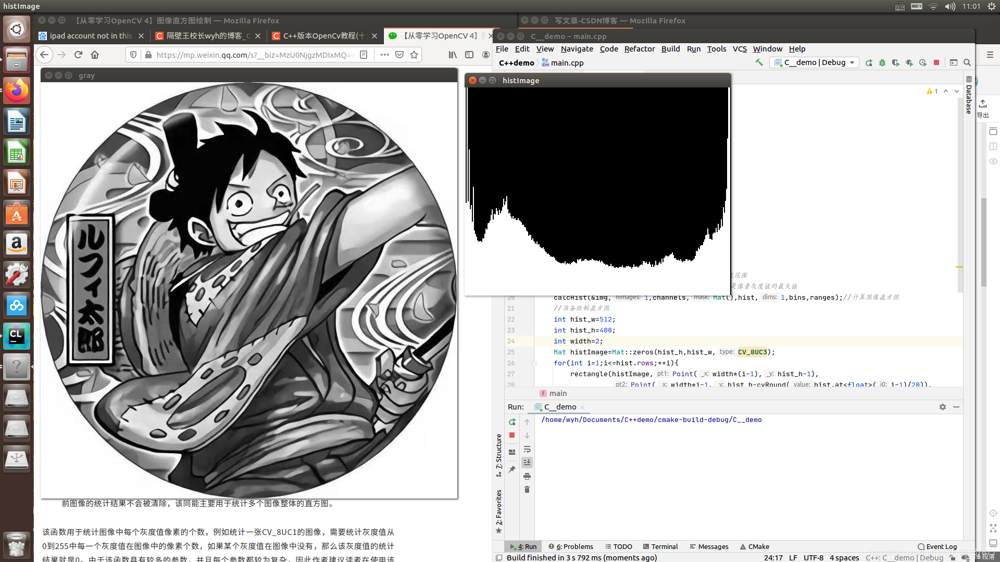
   
2. ```cv.calcHist([image],[i],None,[256],[0,256])```  - Python写法
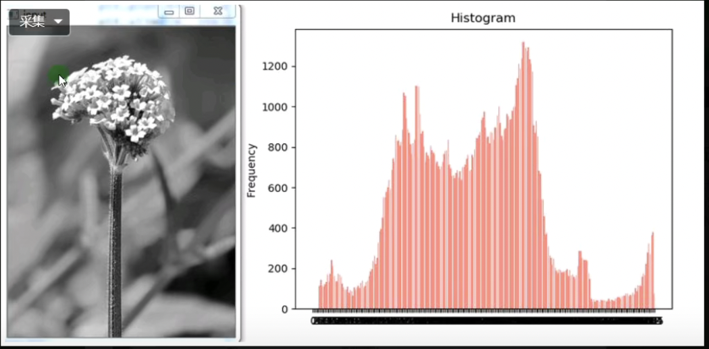

3. 二维的直方图
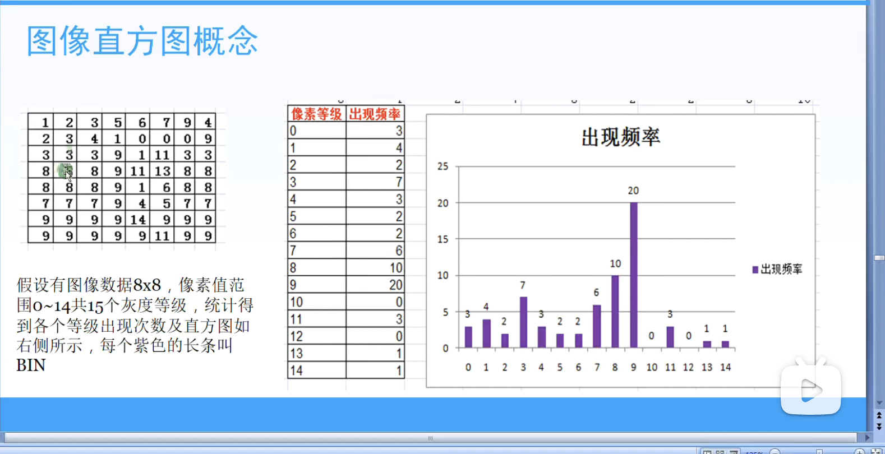
   

## day22:直方图均衡化
直方图均衡化(Histogram Equalization)可以用于图像增强，对输入图像进行直方图均衡化处理，提升后续对象检测的准确率在OpenCV人脸检测的代码演示中已经很常见。此外对医学影像图像与卫星遥感图像也经常通过直方图均衡化来提升图像质量。

[直方图均衡化介绍](https://zhuanlan.zhihu.com/p/44918476)
[OpenCV直方图均衡化计算](https://www.cnblogs.com/yanshw/p/15429887.html

OpenCV中直方图均衡化的API：```equalizeHist(src, dst)```，需要注意的是该函数支持单通道，因此需要先转换成灰度图像

一个直方图均衡化的计算例子

|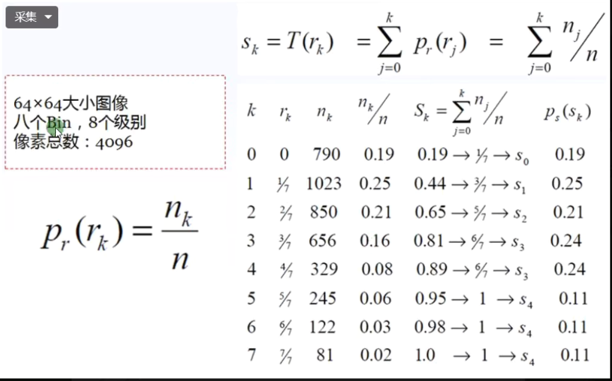|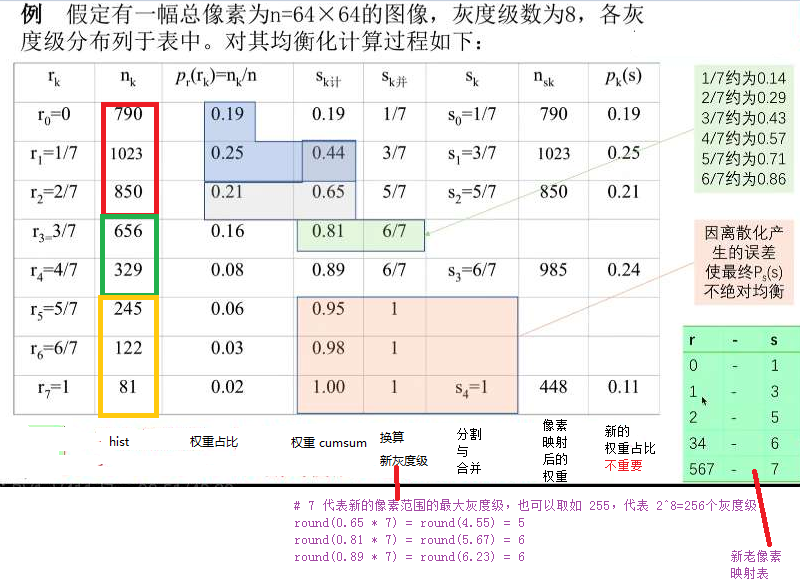|
|---|---|

一个直方图均衡化前后的图像例子

|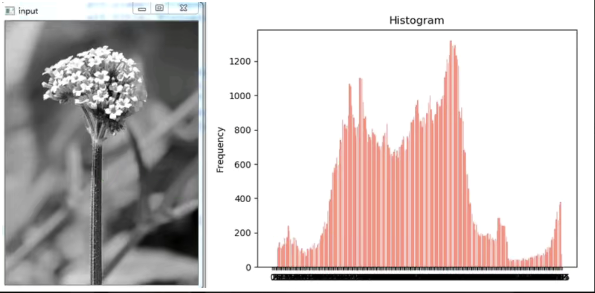|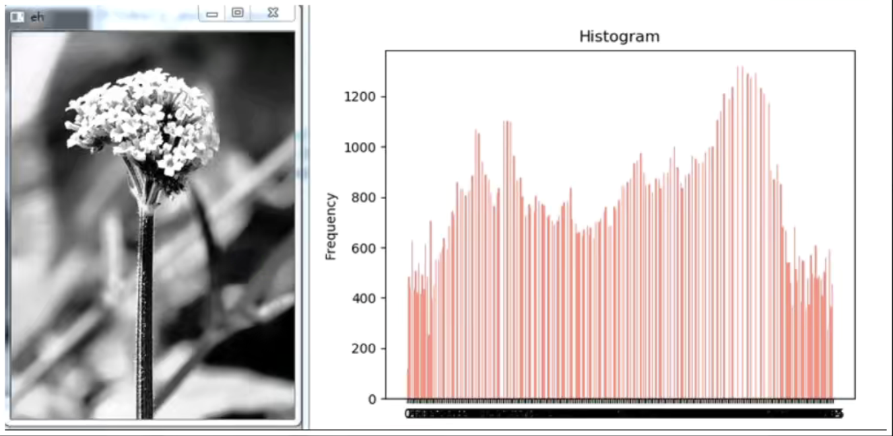|
|---|---|

在demo部分的代码中还涉及到了彩色图像的直方图均衡化：操作是先把RGB彩色图像转成YCrCb格式，对Y分量做直方图均衡化，merge各个通道后转回BGR格式即可。


## day23:图像卷积操作
图像卷及操作可以看成是一个窗口区域在另外一个大的图像上移动，对每个窗口覆盖的区域都进行点乘得到的值作为中心像素点的输出值。窗口的移动是从左到右，从上到下。窗口可以理解成一个指定大小的二维矩阵，里面有预先指定的值。

相关API（C++）
1. ```c++
   blur(InputArray src,                 //输入
        OutputArray dst,                //输出
        Size ksize,                     //窗口大小（kernel）
        Point anchor=(-1,-1),           //默认值
        int borderTYpe = BORDER_DEFAULT //默认值
        )
   /*
    * 第一个参数，InputArray类型的src，输入图像，即源图像，填Mat类的对象即可。该函数对通道是独立处理的，且可以处理任意通道数的图片，但需要注意，待处理的图片深度应该为CV_8U, CV_16U, CV_16S, CV_32F 以及 CV_64F之一。
    * 第二个参数，OutputArray类型的dst，即目标图像，需要和源图片有一样的尺寸和类型。比如可以用Mat::Clone，以源图片为模板，来初始化得到如假包换的目标图。
    * 第三个参数，Size类型（对Size类型稍后有讲解）的ksize，内核的大小。一般这样写Size( w,h )来表示内核的大小( 其中，w 为像素宽度， h为像素高度)。Size（3,3）就表示3x3的核大小，Size（5,5）就表示5x5的核大小
    * 第四个参数，Point类型的anchor，表示锚点（即被平滑的那个点），注意他有默认值Point(-1,-1)。如果这个点坐标是负值的话，就表示取核的中心为锚点，所以默认值Point(-1,-1)表示这个锚点在核的中心。
    * 第五个参数，int类型的borderType，用于推断图像外部像素的某种边界模式。有默认值BORDER_DEFAULT，我们一般不去管它。
    */
   ```
2. ```Python
   dst = cv.blur(src, ksize[, dst[, anchor[, borderType]]])
   ```

卷积计算图示：本质是点乘，也是一种线性计算。边缘由于不能和卷积核完全重合因此没有变，一个5*5的图像经过3*3卷积核的计算，有效的计算点也是3*3了，边缘有两种处理方式，一是扔掉二是填充（padding）。卷积核的尺寸一般定义成奇数，对中心化更友好一些。
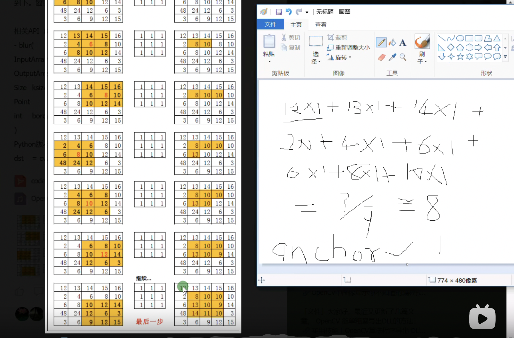

以上例子中卷积核的权重全是1，叫做均值卷积，它的问题就是会让图像变得模糊，缩小了像素之间的差异，降低了对比度，会造成信息丢失，在OpenCV中blur函数可以做到均值卷积的效果。


## day24:高斯模糊+高斯双边模糊
1. 图像均值与高斯模糊 
   
均值模糊是卷积核的系数完全一致，高斯模糊考虑了中心像素距离的影响，对距离中心像素使用高斯公式生成不同的权重系数给卷积核，然后用此卷积核完成图像卷积得到输出结果就是图像高斯模糊之后的输出。 
   
OpenCV高斯模糊相关API:
```c++
void GaussianBlur{
    InputArray src,
    OutputArray dst,
    Size ksize, //Ksize为高斯滤波器窗口大小
    double sigmaX, //X方向滤波系数
    double sigmaY, //Y方向滤波系数
    int borderType=BORDER_DEFAULT //默认边缘系数插值方法
};
/*
 * src – 输入图片，可以使是任意通道数，该函数对通道是独立处理的，但是深度只能是CV_8U, CV_16U, CV_16S, CV_32F or CV_64F.
 * dst – 输出图片，和输入图片相同大小和深度。
 * ksize – 高斯内核大小。ksize.width和ksize.height允许不相同但他们必须是正奇数。或者等于0，由参数sigma的乘积决定。
 * sigmaX – 高斯内核在X方向的标准偏差。
 * sigmaY – 高斯内核在Y方向的标准偏差。如果sigmaY为0，他将和sigmaX的值相同，如果他们都为0，那么他们由ksize.width和ksize.height计算得出。
 * 在高斯分布中，方差可以理解为这个高斯分布的平缓程度，也就是说中间值所占比重的大小，方差越小，中间值所占比重越大，此时模糊的效果会相对更低一点（在同一个size下）
 * borderType – 用于判断图像边界的模式。
 */
```

高斯模糊的卷积核和计算公式、高斯核函数示意图如下：

|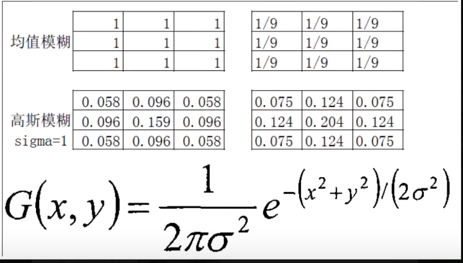|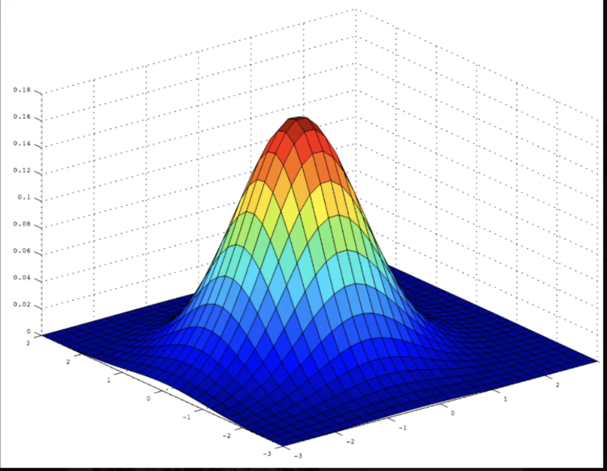|
|---|---|

2. 边缘保留滤波算法-高斯双边模糊

前面我们介绍的图像卷积处理无论是均值还是高斯都是属于模糊卷积，它们都有一 个共同的特点就是模糊之后图像的叫息不复存在，受到了破坏。我们今天介绍 的滤波方法有能力通过卷积处理实现图像模糊的同时对图像边缘不会造成破坏，滤 波之后的输出完整的保存了图像整体边缘（轮廓）信息，我们称这类滤波算法为边 缘保留滤波算法（EPF）。最常见的边缘保留滤波算法有以下几种
- 高斯双边模糊
- Meanshifti匀值迁移模糊
- 局部均方差模糊
- OpenCV中对边缘保留滤波还有一专门的API

高斯模糊是考虑图像空间位置对权重的影响，但是它没有考虑图像像素分布对图像卷积输出的影响，双边模糊考虑像素值分布的影响，对像素值空间分布差异较大的进行保留从而完整地保留了图像的边缘信息
```c++
void bilateralFilter(
   InputArray src,
   OutputArray 	dst,
   int 	d,
   double 	sigmaColor,
   double 	sigmaSpace,
   int 	borderType = BORDER_DEFAULT
)
/*
 * InputArray src: 输入图像，可以是Mat类型，图像必须是8位或浮点型单通道、三通道的图像。 
 * OutputArray dst: 输出图像，和原图像有相同的尺寸和类型。 
 * int d: 表示在过滤过程中每个像素邻域的直径范围。如果这个值是非正数，则函数会从第五个参数sigmaSpace计算该值。 
 * double sigmaColor: 颜色空间过滤器的sigma值，这个参数的值月大，表明该像素邻域内有越宽广的颜色会被混合到一起，产生较大的半相等颜色区域。
 * double sigmaSpace: 坐标空间中滤波器的sigma值，如果该值较大，则意味着越远的像素将相互影响，从而使更大的区域中足够相似的颜色获取相同的颜色。当d>0时，d指定了邻域大小且与sigmaSpace无关，否则d正比于sigmaSpace.
 *int borderType=BORDER_DEFAULT: 用于推断图像外部像素的某种边界模式，有默认值BORDER_DEFAULT.
 */
```

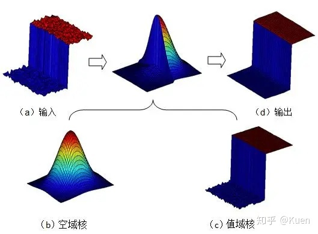

双边滤波器可以很好的保存图像边缘细节而滤除掉低频分量的噪音，但是双边滤波器的效率不是太高，花费的时间相较于其他滤波器而言也比较长。

3. 其他资料

[OpenCV高斯双边模糊介绍](https://blog.csdn.net/qq_41498261/article/details/101618119)

[均值、中值、双边、高斯模糊介绍](http://www.4k8k.xyz/article/Vici__/102476784)


## day25:实时人脸检测
直接借助OpenCV4自带的dnn模块，不过所用的模型是从老师Github上下载的，效果很差。
```c++
void QuickDemo::faceDetectionDemo() {
    // 效果很垃圾的感觉
    std::string rootDir = "../face_detector/";
    cv::dnn::Net net = cv::dnn::readNetFromTensorflow(rootDir + "opencv_face_detector_uint8.pb",rootDir + "opencv_face_detector.pbtxt");
    // 用摄像头拍自己
//    VideoCapture capture(0);
    VideoCapture capture(rootDir + "face_detector.avi");
    Mat frame;
    while(true){
        capture.read(frame);
        if(frame.empty()){
            break;
        }
        /*
         * scalefactor：图像像素数值normalize到0-1.0
         * Size，mean都是和模型有关的
         * SwapRB：是否要交换RB
         */
        Mat blob = dnn::blobFromImage(frame, 1.0, Size(300,300), Scalar(104,177,123), false, false);
        net.setInput(blob); // 出来的格式是NCHW
        Mat probs = net.forward(); // 4个维度，第一维是图像编号，img的index；第二个维度对应该img的批次，即batch index；第三个维度表示有多少个框；第四个维度表示每个框有7个值（7列）？

        // 解析结果
        Mat detectionMat(probs.size[2],probs.size[3], CV_32F, probs.ptr<float>());
        for(int i = 0; i < detectionMat.rows; i++){
            //解析检测到的框
            float confidence = detectionMat.at<float>(i,2);
            // 若置信度大于0.5则认为检测到了人脸
            if(confidence > 0.5){
                // 解析矩形框的坐标，预测出来的值是0~1的，必须乘以宽度才是正确的像素坐标
                int x1 = static_cast<int>(detectionMat.at<float>(i,3)*frame.cols);
                int y1 = static_cast<int>(detectionMat.at<float>(i,4)*frame.cols);
                int x2 = static_cast<int>(detectionMat.at<float>(i,5)*frame.cols);
                int y2 = static_cast<int>(detectionMat.at<float>(i,6)*frame.cols);
                std::cout << x1 << "," << y1 << ", " << x2 << ", " << y2 << std::endl;
                Rect box(x1,y1,x2-x1,y2-y1);
                rectangle(frame, box, Scalar(0,0,255),2,LINE_8, 0);
                imshow("face detection", frame);
            }
        }
        int c = waitKey(100);
        if(c == 27 || c == 13){
            break;
        }
    }
}
```
